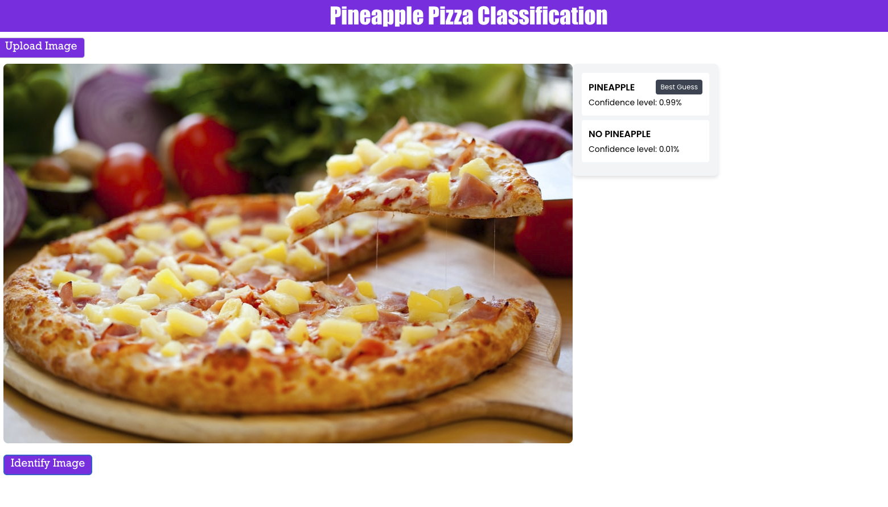

# CNN Classifier for Pineapple Pizza

This project showcases a toy Convolutional Neural Network capable of detecting pineapple chunks on a colored image of a pizza. The model is trained from scratch using TensorFlow and scraped data.


## Prerequisites
Install the dependencies 
``` bash
pip install -r requirements.txt
```

## Running the Web App
To run:
Go To the flask_server directory:
```bash
python server.py
```
Then:
Go to the react_client directory:
```bash
npm start
```
